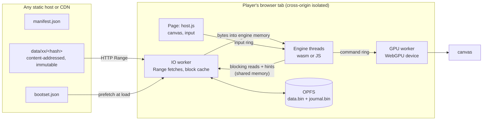

# rangeplay

**Play-as-you-download for the web.** Run a game engine compiled to WebAssembly in a browser tab, and stream its
data from any CDN while it plays. There are no game servers and no data-center GPUs, and nothing is video-encoded.
The network carries game data once, then mostly serves cache hits.

**[Try the demo](https://rangeplay.vercel.app)** (needs a current Chromium-based browser for WebGPU; others fall back to
a 2D canvas).

[](https://rangeplay.vercel.app)

<sub>The demo, [`examples/tile-world`](examples/tile-world): 144 MB of terrain in 36 archive files. On the dev
server's simulated network (40 ms latency, 3 MB/s per response) its engine starts in 0.6 s on an empty cache, 2.4 s
without a boot set, and 0.1 s on a return visit. Tiles stream in as the camera moves.</sub>

## This is not cloud gaming

It is the other trade-off. Cloud gaming moves the computer to the data center and streams pixels. rangeplay keeps the
computer where it is and streams the game's files.

|                              | Cloud gaming (video streaming)                       | rangeplay (local execution, streamed data)                    |
| ---------------------------- | ---------------------------------------------------- | ------------------------------------------------------------- |
| Where the game runs          | A GPU in a data center                               | The player's device                                           |
| What crosses the network     | Video down and input up, every frame, all session    | Game data, once; later visits are mostly cache hits           |
| What it costs to serve       | GPU-hours per concurrent player                      | CDN bytes per new player or new content                       |
| Input latency                | A network round trip plus encode and decode          | Local                                                         |
| Device needed                | Anything that plays video                            | A capable CPU/GPU and a current browser                       |
| First minute                 | Instant                                              | Engine plus boot set download (tens to hundreds of MB)        |
| The game's files             | Never leave the server                               | On the player's device, like any download (this is not DRM)   |

Cloud gaming still wins for high-end games on weak devices. rangeplay fits games that can run on the player's
hardware but should start from a link: web distribution, demos, back catalogs, user-generated content.

## How it works



- **Engine threads read files as if they were on disk.** A read blocks the thread (`Atomics.wait`) until the IO worker
  has put the bytes into the engine's own memory. Native engines need no async rewrite of their file layer.
- **The IO worker streams HTTP Range responses straight into a persistent cache in the Origin Private File System.**
  Responses go chunk by chunk into an append-only file, with a journal written after the data is flushed. No large
  JavaScript buffers pile up in threads that never get to collect garbage.
- **Fetching ahead of the engine.** The engine can announce reads it will make soon (hints), sequential reads trigger
  read-ahead, and a recorded *boot set* of start-up reads downloads in parallel with engine start-up.
- **Priorities.** Reads an engine thread is blocked on go first, at high fetch priority, split into parallel slices.
  Speculative fetches wait their turn at low priority, and are promoted the moment something blocks on them.
- **Content-addressed data.** Every file is stored under its hash, so URLs never change their bytes. CDNs and
  browsers cache them forever, identical files are stored once, and an update only invalidates the files that changed.
  The cache on the player's device is keyed the same way, so it survives updates.
- **A GPU worker owns WebGPU.** WebGPU is asynchronous and its objects cannot be shared between threads. The engine
  writes commands into a ring in shared memory and the GPU worker executes them, paced to the display.

[docs/architecture.md](docs/architecture.md) explains each decision and its alternatives.
[docs/protocol.md](docs/protocol.md) specifies the shared-memory protocol.

## Quick start

Requires Node 20 or later. There are no dependencies.

```bash
npm run demo:build
```

```bash
npm run demo
```

Then open <http://localhost:8080/examples/tile-world/>. The dev server adds 40 ms of latency and caps each response
at 3 MB/s, so streaming is visible. Use **Clear cache and reload** to see a first visit again; add `?nobootset=1` to
see what the boot set saves. `npm test` runs the test suite; `npm run test:native` builds and runs the C protocol test.

## Using it

rangeplay is not on npm yet. Install it from a clone (`npm install ../rangeplay`) to get the `rangeplay` command and
the `rangeplay/*` imports, or import `src/host.js` and `src/engine.js` by relative path.

**1. Pack your data.** This hashes every file into `dist/data/` and writes `dist/manifest.json`.

```bash
npx rangeplay pack ./gamedata --out ./dist --name my-game
```

**2. Start it from the page.**

```js
import { start } from 'rangeplay/host';

const game = await start({
  canvas: document.querySelector('canvas'),
  manifest: './dist/manifest.json',
  bootset: './dist/bootset.json',                          // optional
  engine: new URL('./engine-worker.js', import.meta.url),   // your engine, as a module worker
  gpuHandlers: new URL('./gpu.js', import.meta.url),        // your engine's GPU commands
  onStats: (s) => console.log(s.bytesFetched, s.store.bytes),
});
```

**3. Read files from the engine.** An engine written in JavaScript uses `src/engine.js`:

```js
import { connect } from 'rangeplay/engine';

const rt = await connect({ heapBytes: 64 << 20 });
const id = rt.files.id('levels/level1.pak');
const buf = rt.heap.alloc(4096);
const n = rt.io.readSync(id, 0, 4096, buf);           // blocks this thread until the bytes are in
rt.io.hint(id, 1 << 20, 256 << 10);                    // "I will read this soon"
```

A C or C++ engine uses the single header [`native/rangeplay.h`](native/rangeplay.h):

```c
int64_t n = rp_read(ctl, file_id, offset, dst, len, 0);   /* same protocol, from any pthread */
rp_hint(ctl, file_id, next_offset, next_len, 0);
```

[docs/emscripten.md](docs/emscripten.md) walks through an Emscripten build.

**4. Record a boot set.** Load the game with `record: true` and play the opening. Save
`game.takeRecording()` as JSON, then merge several recordings:

```bash
npx rangeplay bootset merge rec1.json rec2.json -o dist/bootset.json
```

**5. Deploy** to any static host or CDN that serves byte ranges. (The demo itself is deployed this way: see
[`vercel.json`](vercel.json) and [`scripts/build-site.js`](scripts/build-site.js).) The page needs cross-origin isolation headers, and
the objects need immutable caching. `rangeplay headers <cloudflare|netlify|nginx|caddy|vercel>` prints the
configuration for that host; [docs/deploying.md](docs/deploying.md) has the details.

## Browser requirements

| Needs                                   | For                                       | Without it                                                 |
| --------------------------------------- | ----------------------------------------- | ---------------------------------------------------------- |
| Cross-origin isolation, SharedArrayBuffer | Engine threads, blocking reads            | Does not start (`start()` explains which headers to set)   |
| OffscreenCanvas                         | Drawing from the GPU worker               | Does not start                                             |
| OPFS sync access handles                | The persistent cache                      | In-memory cache, plus the browser's HTTP cache             |
| WebGPU                                  | Your engine's renderer                    | Your handlers decide; the demo falls back to a 2D canvas   |
| `Atomics.waitAsync`                     | Waking the IO and GPU workers             | They poll with a short backoff                             |
| Web Locks                               | One tab owning the cache                  | No multi-tab protection                                    |

Tested so far: Chromium 152 on Windows (the demo on WebGPU and on the 2D fallback) and Node 26 (the test suite).
Firefox and Safari are untested; reports are welcome.

## Status and limits

This is version 0.1, and experimental. What is tested:

- The IO path end to end in Node: real HTTP, engine threads in `worker_threads`, both stores, 503 storms, stalled
  and misbehaving servers, damaged caches, cache reuse across sessions and versions, boot sets and hints.
- The C header natively (6 threads, 18,000 reads; 200,000 ring records) with `-Wall -Wextra -Werror`.
- The demo in Chromium.

Not done yet:

- An Emscripten engine running end to end in CI. The protocol is tested from both sides, but the glue in
  [docs/emscripten.md](docs/emscripten.md) has not run against a real build.
- Store compaction. Space held by old versions is only reclaimed when more than half of a large store is dead.
- Bundling small files into packs, per-block compression, and offline start (a service worker for the page itself).

## Prior art

None of the pieces are new. Emscripten has lazily loaded files, Unity and Godot export to WebAssembly, and consoles
have offered "play as you download" for years. rangeplay packages the part each large port ends up rebuilding on its
own: an IO path for engine threads that block, a persistent cache, boot sets and read hints, and a GPU worker.

## Content

Only ship content you own or have licensed. rangeplay makes a game's files downloadable by design. It is not a
protection mechanism.

## License

[MIT](LICENSE)
