# rangeplay

**Play-as-you-download for the web.** Run a game engine compiled to WebAssembly in a browser tab, and stream its
data from any CDN while it plays. There are no game servers and no data-center GPUs, and nothing is video-encoded.
The network carries game data once, then mostly serves cache hits.

[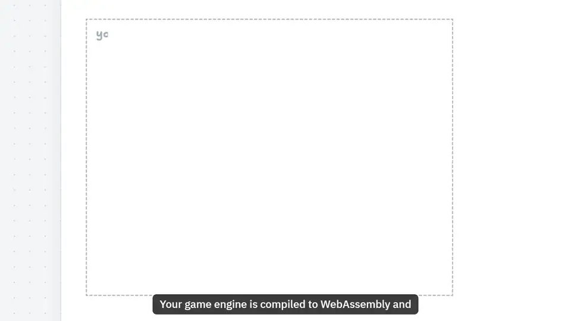](https://rangeplay.vercel.app/video/)

**[▶ Watch the 2-minute explainer](https://rangeplay.vercel.app/video/)** (with sound) ·
**[Try the demos](https://rangeplay.vercel.app)** (best in a current Chromium-based browser, for WebGPU; others fall
back to a 2D canvas)

## Why I built this

On 6 October 2026 I came across someone running GTA V in a web browser. GTA V takes more than 100 GB on disk, and
there it was, playing in a browser tab. I found that fascinating, so I took it apart to see how it worked. It didn't
download the game first. It started playing after about 2 GB, and fetched the rest while you played.

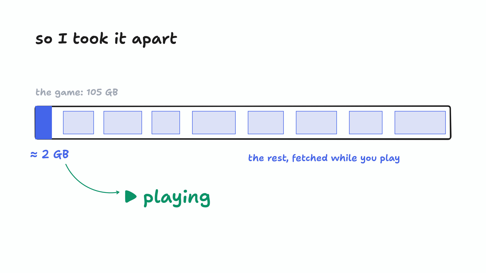

Cloud gaming already promises games without installs, but the way it delivers them is a livestream you can control.
The game runs on a GPU in a data center, and every frame is encoded and sent to you, for as long as you play.

What if a game worked like a video instead? A video never downloads before it plays: it loads the next few seconds,
just before you need them. A game can do the same with its data. It runs on your own device and fetches each level as
you reach it, then rebuilds it locally into a smooth, on-device experience. Instead of installing games, you would
open them the way you open a video. Imagine Netflix, for games.

| Cloud gaming: a livestream you can control | What if games loaded like a video? |
| --- | --- |
| 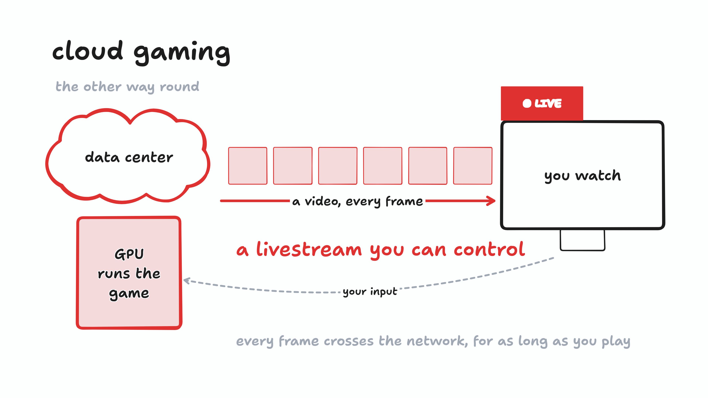 | 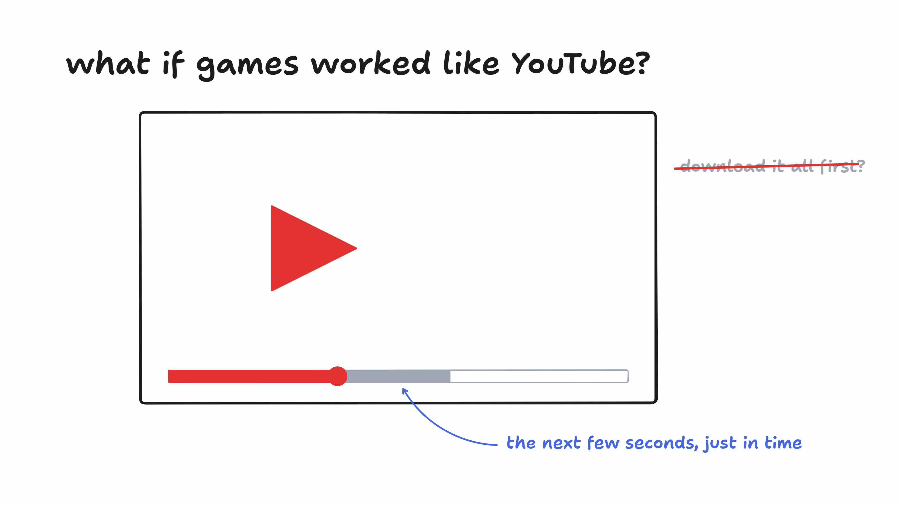 |

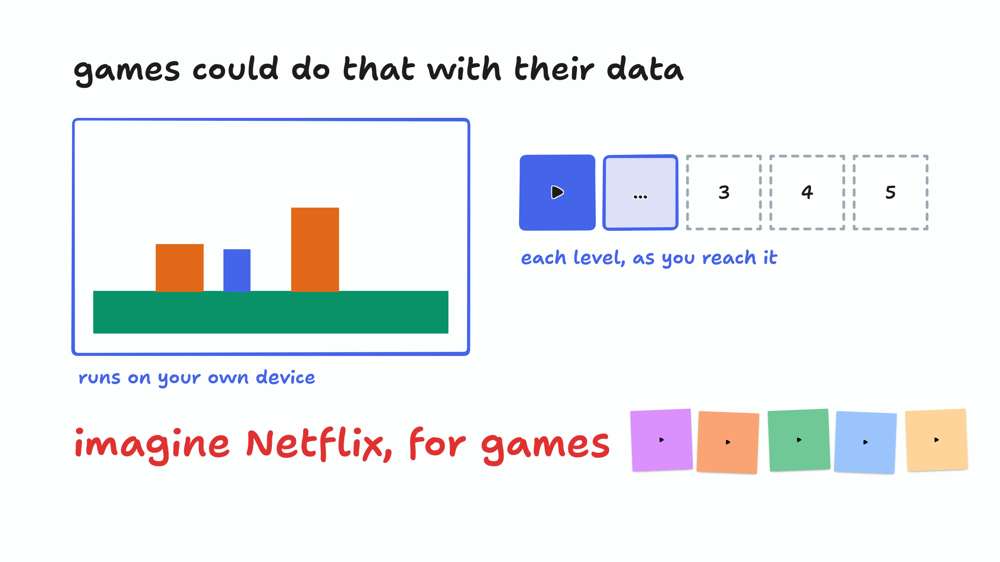

Fortnite is already heading there. It runs whole games inside one app: Battle Royale, Save the World, LEGO Fortnite,
Festival. You pick one and play, with nothing else to install. And the Unreal Engine 6 teaser (May 2026, the engine
that merges Unreal Engine 5 with UEFN around Verse) showed Rocket League at `verse://rocketleague.com`, right next to
Fortnite, LEGO and Disney. I think this could be a really interesting model for gaming.

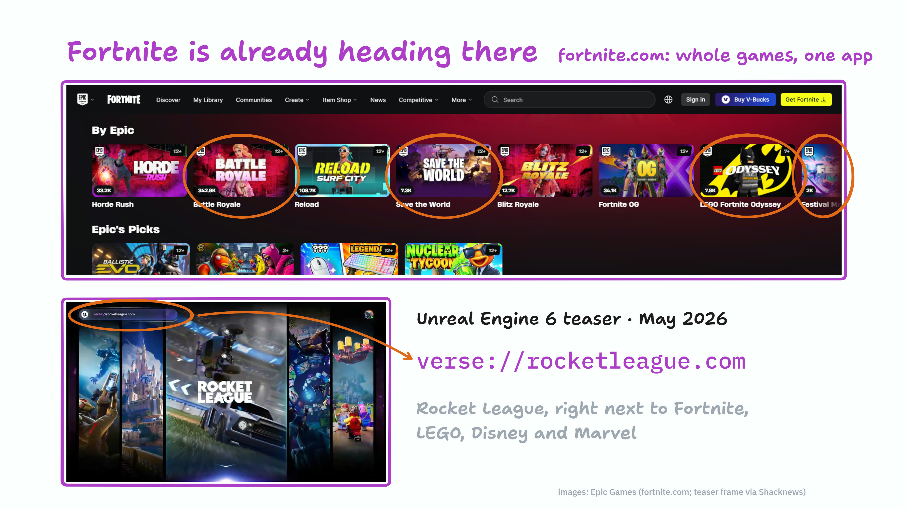

<sub>Screenshots: Epic Games (fortnite.com; the teaser frame as captured by Shacknews), shown here for commentary.
Portions of the materials used are trademarks and/or copyrighted works of Epic Games, Inc. This project is not
affiliated with or endorsed by Epic.</sub>

So I built an open-source version for any engine. rangeplay is a clean-room implementation: it contains no code or
data from that port, or from GTA V. The demos below run free games: Freedoom, LibreQuake, and a generated world.

## Demos

| [LibreQuake](https://rangeplay.vercel.app/examples/quake/): a 210 MB game, streamed a level at a time |
| --- |
| [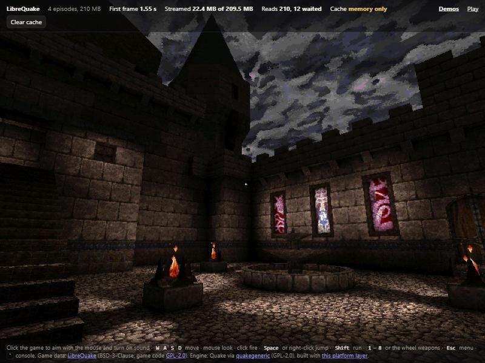](https://rangeplay.vercel.app/examples/quake/) |
| The Quake engine, compiled with Emscripten and brought up to what modern maps need (engine.patch), plays a 4-episode game of 54 maps. Each level downloads when the engine loads it. From an empty cache, the first demo's 9.8 MB level is loaded in **4.1 s** with a boot set (19.7 s without), and levels you never visit never download. |

| [Freedoom](https://rangeplay.vercel.app/examples/freedoom/): a complete game | [tile-world](https://rangeplay.vercel.app/examples/tile-world/): a streamed world |
| --- | --- |
| [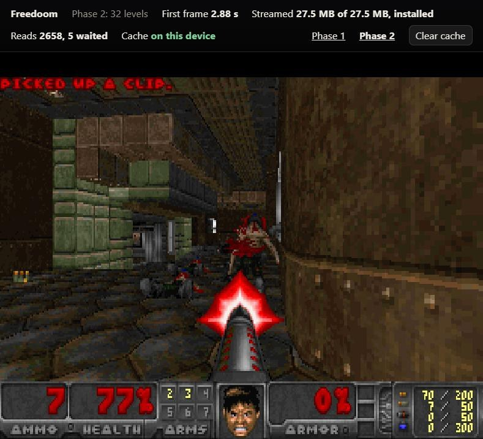](https://rangeplay.vercel.app/examples/freedoom/) | [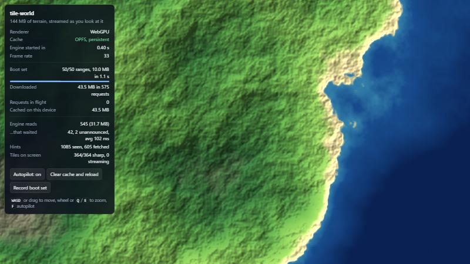](https://rangeplay.vercel.app/examples/tile-world/) |
| The unmodified Doom engine, compiled from C with Emscripten, reads its 27.5 MB game through rangeplay. From an empty cache: first frame in **2.9 s** (85 s without a boot set), 5 of 2,600 start-up reads waited on the network, and the rest of the game installed in the background. | 144 MB of terrain in 36 archives. Tiles stream in as the camera moves, fetched ahead of it from read hints. The engine starts in 0.6 s on an empty cache, 2.4 s without a boot set, and 0.1 s on a return visit. |

<sub>Timings from the dev server's simulated network: 40 ms latency, 3 MB/s per response, HTTP/1.1.</sub>

## This is not cloud gaming

It is the other trade-off. Cloud gaming moves the computer to the data center and streams pixels. rangeplay keeps the
computer where it is and streams the game's files.

|                              | Cloud gaming (video streaming)                       | rangeplay (local execution, streamed data)                    |
| ---------------------------- | ---------------------------------------------------- | ------------------------------------------------------------- |
| Where the game runs          | A GPU in a data center                               | The player's device                                           |
| What crosses the network     | Video down and input up, every frame, all session    | Game data, once; later visits are mostly cache hits           |
| What it costs to serve       | GPU-hours per concurrent player                      | CDN bytes per new player or new content                       |
| Input latency                | A network round trip plus encode and decode          | Local                                                         |
| Device needed                | Anything that plays video                            | A capable CPU/GPU and a current browser                       |
| First minute                 | Instant                                              | Engine plus boot set download (tens to hundreds of MB)        |
| The game's files             | Never leave the server                               | On the player's device, like any download (this is not DRM)   |

Cloud gaming still wins for high-end games on weak devices. rangeplay fits games that can run on the player's
hardware but should start from a link: web distribution, demos, back catalogs, user-generated content.

## How it works

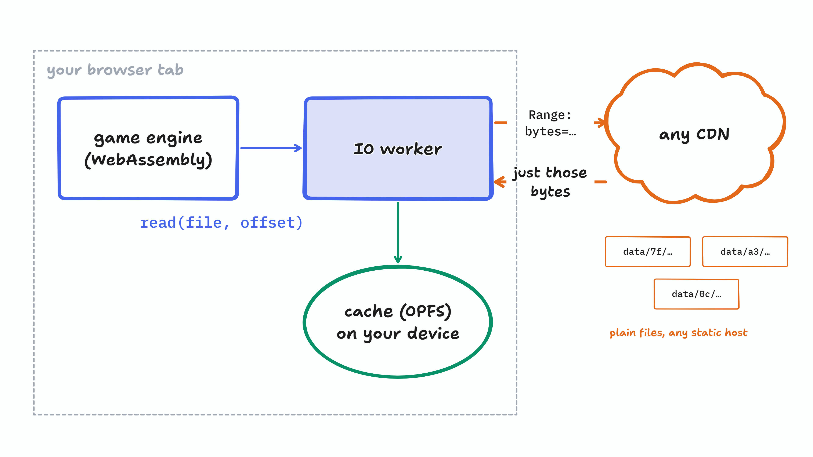

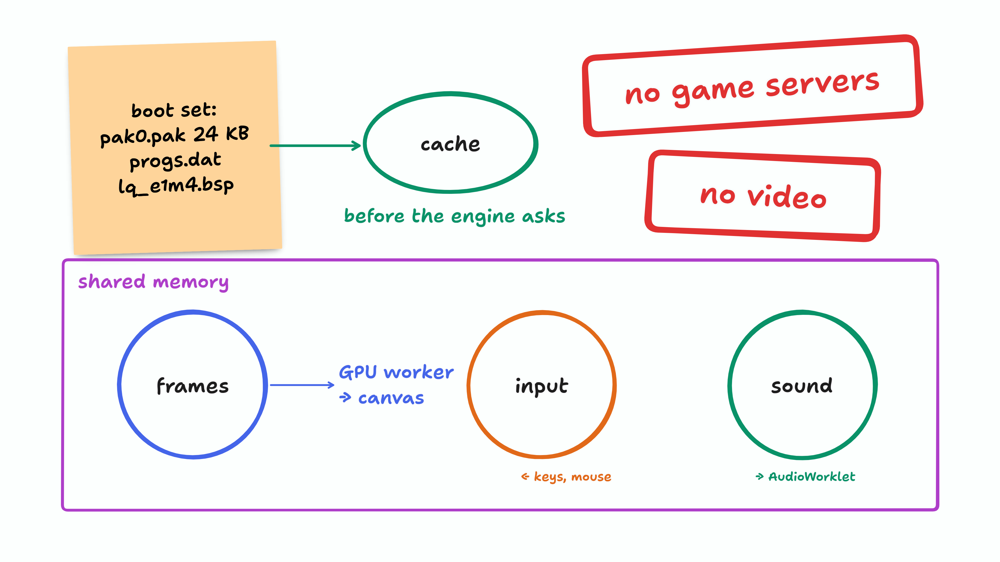

The drawings come from one tldraw board, [docs/explainers/rangeplay.tldr](docs/explainers/rangeplay.tldr): open it in
[tldraw](https://www.tldraw.com) to see the whole story on one canvas. In detail:

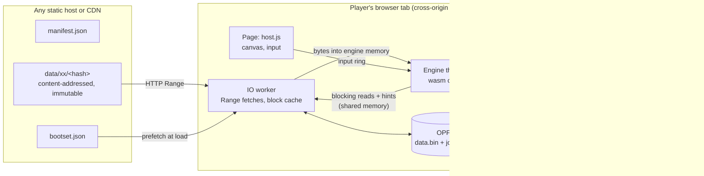

- **Engine threads read files as if they were on disk.** A read blocks the thread (`Atomics.wait`) until the IO worker
  has put the bytes into the engine's own memory. Native engines need no async rewrite of their file layer.
- **The IO worker streams HTTP Range responses straight into a persistent cache in the Origin Private File System.**
  Responses go chunk by chunk into an append-only file, with a journal written after the data is flushed. No large
  JavaScript buffers pile up in threads that never get to collect garbage.
- **Fetching ahead of the engine.** The engine can announce reads it will make soon (hints), sequential reads trigger
  read-ahead, and a recorded *boot set* of start-up reads downloads in parallel with engine start-up.
- **Priorities.** Reads an engine thread is blocked on go first, at high fetch priority, split into parallel slices.
  Speculative fetches wait their turn at low priority, and are promoted the moment something blocks on them.
- **Content-addressed data.** Every file is stored under its hash, so URLs never change their bytes. CDNs and
  browsers cache them forever, identical files are stored once, and an update only invalidates the files that changed.
  The cache on the player's device is keyed the same way, so it survives updates.
- **Audio and input through shared memory too.** The engine's mixer writes PCM into a ring that an AudioWorklet plays.
  The page writes keyboard, mouse and resize events into a ring the engine polls, with optional pointer lock for
  mouse look.
- **A GPU worker owns WebGPU.** WebGPU is asynchronous and its objects cannot be shared between threads. The engine
  writes commands into a ring in shared memory and the GPU worker executes them, paced to the display.

[docs/architecture.md](docs/architecture.md) explains each decision and its alternatives.
[docs/protocol.md](docs/protocol.md) specifies the shared-memory protocol.

## Quick start

Requires Node 20 or later. There are no dependencies.

```bash
npm run demo:build
```

```bash
npm run demo
```

Then open <http://localhost:8080/examples/tile-world/>. For Freedoom, run `node examples/freedoom/build.js` first
(it downloads the game, 24 MB), then open <http://localhost:8080/examples/freedoom/>. The engine is prebuilt in
`examples/freedoom/wasm/`.

The dev server adds 40 ms of latency and caps each response at 3 MB/s, so streaming is visible. Use **Clear cache** to
see a first visit again, and add `?nobootset=1` to see what the boot set saves. `npm test` runs the test suite;
`npm run test:native` builds and runs the C protocol test.

## Examples

- **[examples/quake](examples/quake):** the Quake engine and a modern 210 MB game. It covers serving reads the engine
  makes with `fopen` (demos played straight from the pak), a palette-lookup GPU handler, an old DMA-style sound mixer
  on the audio ring, and bringing a 1996 engine up to what today's maps need.
- **[examples/freedoom](examples/freedoom):** a native engine ported to rangeplay. It covers the platform layer in C,
  the Emscripten build, a recorded boot set and background install. Read this one if you have a C or C++ engine.
- **[examples/tile-world](examples/tile-world):** an engine written in JavaScript. It covers archives with tables of
  contents, a streamer thread, read hints, WebGPU drawing through the command ring, and the IO statistics.
- **[examples/check](examples/check):** the browser check. It tests what games need on the player's device (shared
  memory, the on-device cache, WebGPU and its adapter, byte ranges to the data) and makes a report to paste into an
  issue. The demos link to it when they cannot start.

## Using it

rangeplay is not on npm yet. Install it from a clone (`npm install ../rangeplay`) to get the `rangeplay` command and
the `rangeplay/*` imports, or import `src/host.js` and `src/engine.js` by relative path.

**1. Pack your data.** This hashes every file into `dist/data/` and writes `dist/manifest.json`.

```bash
npx rangeplay pack ./gamedata --out ./dist --name my-game
```

If the game has hundreds of small files (shaders, scripts, configs), add `--pack-small 64k`: files under 64 KB go into
packs of a few MB, so loading hundreds of them costs a handful of requests instead of one each. In our benchmark, 600
small files loaded in 0.5 s instead of 2.2 s, and the host stored 20 objects instead of 2,001
([architecture.md](docs/architecture.md#decisions-and-why), "Packs for small files"). `rangeplay inspect` tells you
when a manifest would gain from it.

**2. Start it from the page.**

```js
import { start } from 'rangeplay/host';

const game = await start({
  canvas: document.querySelector('canvas'),
  manifest: './dist/manifest.json',
  bootset: './dist/bootset.json',                          // optional
  engine: new URL('./engine-worker.js', import.meta.url),   // your engine, as a module worker
  gpuHandlers: new URL('./gpu.js', import.meta.url),        // your engine's GPU commands
  onStats: (s) => console.log(s.bytesFetched, s.store.bytes),
});
```

**3. Read files from the engine.** An engine written in JavaScript uses `src/engine.js`:

```js
import { connect } from 'rangeplay/engine';

const rt = await connect({ heapBytes: 64 << 20 });
const id = rt.files.id('levels/level1.pak');
const buf = rt.heap.alloc(4096);
const n = rt.io.readSync(id, 0, 4096, buf);           // blocks this thread until the bytes are in
rt.io.hint(id, 1 << 20, 256 << 10);                    // "I will read this soon"
```

A C or C++ engine uses the single header [`native/rangeplay.h`](native/rangeplay.h):

```c
int64_t n = rp_read(ctl, file_id, offset, dst, len, 0);   /* same protocol, from any pthread */
rp_hint(ctl, file_id, next_offset, next_len, 0);
```

[docs/emscripten.md](docs/emscripten.md) walks through an Emscripten build, step by step, using the Freedoom port.

**Options for real games.**
- `pointerLock: true`: a click locks the pointer, for mouse look.
- `fineTimers: true`: a workaround for Chrome on Windows, which rounds short `Atomics.wait` timeouts up to the 15.6 ms
  system tick.
- `onStall(info)`: called with `game.debug()` if loading stops making progress.
- `game.audio()`: the audio ring's level and underruns.
- `game.gpu()`: which GPU the game draws with (vendor, architecture, software fallback or not), why it fell back to the
  2D canvas if it did, and how many WebGPU errors and lost devices there were. Attach it to bug reports.
- `onGpuLost(info)`, `onGpuRestored(gpu)`: a lost WebGPU device (a driver reset, a GPU process crash) is replaced and
  the GPU handlers' `setup()` runs again. Handlers that upload resources once must upload them again then.

An engine gets an audio ring with `connect({ audio: { frames, channels, rate } })` in JavaScript, or `rp_audio_*` in C.

**4. Record a boot set.** Load the game with `record: true` and play the opening. Save
`game.takeRecording()` as JSON. To have the rest of the game download in the background after the boot set, pass
`io: { backgroundFill: ['game.pak'] }`. To merge several recordings:

```bash
npx rangeplay bootset merge rec1.json rec2.json -o dist/bootset.json
```

**5. Deploy** to any static host or CDN that serves byte ranges. (The demo itself is deployed this way: see
[`vercel.json`](vercel.json) and [`scripts/build-site.js`](scripts/build-site.js).) The page needs cross-origin isolation headers, and
the objects need immutable caching. `rangeplay headers <cloudflare|netlify|nginx|caddy|vercel>` prints the
configuration for that host; [docs/deploying.md](docs/deploying.md) has the details.

Check the folder before you upload it, and the host after:

```bash
npx rangeplay verify dist
```

```bash
npx rangeplay doctor https://example.com/my-game/
```

`verify` checks that every object exists and hashes to its name. `doctor` checks what makes a game fail to start or
start slowly, and says what to change: isolation headers, byte ranges, an HTML fallback page served instead of data,
compression on the fly, caching, CORS and the boot set. `rangeplay mirror <manifest URL> --out <dir>` makes a verified,
resumable copy of a published game, to move it to another host.

## Browser requirements

| Needs                                   | For                                       | Without it                                                 |
| --------------------------------------- | ----------------------------------------- | ---------------------------------------------------------- |
| Cross-origin isolation, SharedArrayBuffer | Engine threads, blocking reads            | Does not start (`start()` explains which headers to set)   |
| OffscreenCanvas                         | Drawing from the GPU worker               | Does not start                                             |
| OPFS sync access handles                | The persistent cache                      | In-memory cache, plus the browser's HTTP cache             |
| WebGPU                                  | Your engine's renderer                    | Your handlers decide; the demo falls back to a 2D canvas   |
| `Atomics.waitAsync`                     | Waking the IO and GPU workers             | They poll with a short backoff                             |
| AudioWorklet                            | Playing the engine's audio ring           | Silent                                                     |
| Web Locks                               | One tab owning the cache                  | No multi-tab protection                                    |

Tested so far: Chromium 152 on Windows (both demos, on WebGPU and on the 2D fallback) and Node 20 to 26 (the test
suite).
Firefox and Safari are untested; reports are welcome. The [browser check](https://rangeplay.vercel.app/examples/check/)
tests all of the above on a player's device and makes a report to paste into an issue.

## Status and limits

This is version 0.2, and experimental. What is tested:

- The IO path end to end in Node: real HTTP, engine threads in `worker_threads`, both stores, 503 storms, stalled
  and misbehaving servers, damaged caches, cache reuse across sessions and versions, boot sets and hints, packs.
- The tools against real and deliberately broken hosts: `verify` on damaged, truncated and missing objects, `mirror`
  resuming interrupted and damaged downloads, `doctor` on hosts that drop isolation headers, ignore ranges, compress
  responses or answer with an HTML fallback page.
- The C header natively (6 threads, 18,000 reads; 200,000 ring records) with `-Wall -Wextra -Werror`.
- Real engines through the C header: the Doom and Quake engines built with Emscripten in CI, and played in Chromium.
  All 54 LibreQuake maps load and its three demos play in a headless build of the same engine.

Not done yet:

- Music in the Freedoom and LibreQuake examples. Their sound effects play; Doom's music is MIDI and needs a
  synthesizer, and LibreQuake's is Ogg Vorbis, which the 1996 Quake engine cannot play.
- Store compaction. Space held by old versions is only reclaimed when more than half of a large store is dead.
- Per-block compression, and offline start (a service worker for the page itself).

## Prior art

None of the pieces are new. Emscripten has lazily loaded files, Unity and Godot export to WebAssembly, and consoles
have offered "play as you download" for years. rangeplay packages the part each large port ends up rebuilding on its
own: an IO path for engine threads that block, a persistent cache, boot sets and read hints, and a GPU worker.

## Content

Only ship content you own or have licensed. rangeplay makes a game's files downloadable by design. It is not a
protection mechanism.

## License

[MIT](LICENSE)
